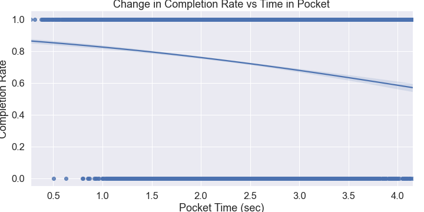

# Predicting NFL QB Completion Rates Using 

#### -- Project Status: [Completed]

## Project Intro
The goal of this project was to predict an NFL quarterback's completion rating using data scraped from [Sportradar](https://www.sportradar.com). The dataset consisted of passer related stats (attempted yards, pocket time, etc.) as well as defensive linemen stats (blitz, players rushed, etc). The data about the coverage on the receiver was not included in the dataset. 

### Methods Used
* Web Scraping/API calls
* Machine Learning
* Data Visualization
* Predictive Modeling

### Technologies
* Python
* Pandas, jupyter
* matplotlib, seaborn
* HTML, JSON, bs4
* sklearn

## Project Description
(Provide more detailed overview of the project.  Talk a bit about your data sources and what questions and hypothesis you are exploring. What specific data analysis/visualization and modelling work are you using to solve the problem? What blockers and challenges are you facing?  Feel free to number or bullet point things here)

Sportradar collects data on all major sports at the professional and collegiate level. The objective of this project was to determine how accurate professional quarterbacks are with their throws. The data collected did not include information pertaining to the receiver or defender on the targetted receiver. The model was focused solely on how accurate quarterbacks are with their throws aimed at different areas of the field.

### How does the direction and distance of the pass affect the completion rate?

(insert 2020 nfl season average qb completion vs pass direc figure)

(insert completion rate vs att_yards lmplot)

### Does time spent in the pocket have an effect on the completion rate of a quarterback?

(insert complete_vs_pocket_time.png)

## Getting Started

1. Clone this repo (for help see this [tutorial](https://help.github.com/articles/cloning-a-repository/)).
2. Raw Data is being kept [here](Repo folder containing raw data) within this repo.

    *If using offline data mention that and how they may obtain the data from the froup)*
    
3. Data processing/transformation scripts are being kept [here](Repo folder containing data processing scripts/notebooks)
4. etc...

*If your project is well underway and setup is fairly complicated (ie. requires installation of many packages) create another "setup.md" file and link to it here*  

5. Follow setup [instructions](Link to file)

## Featured Notebooks/Analysis/Deliverables
* [Notebook/Markdown/Slide Deck Title](link)
* [Notebook/Markdown/Slide DeckTitle](link)
* [Blog Post](link)
