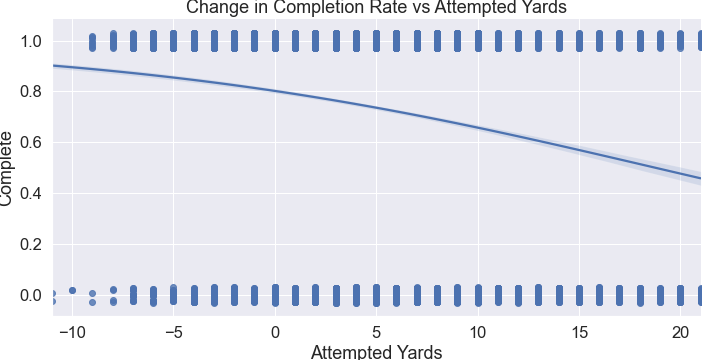

# Predicting NFL QB Completion Rates Using 

## Project Intro
The goal of this project was to predict an NFL quarterback's completion rating using data scraped from [Sportradar](https://www.sportradar.com). The dataset consisted of passer related stats (attempted yards, pocket time, etc.) as well as defensive linemen stats (blitz, players rushed, etc). The data about the coverage on the receiver was not included in the dataset and focused solely on the 

### Methods Used
* Web Scraping/API calls
* Machine Learning
* Data Visualization
* Predictive Modeling

### Technologies
* Python
* Pandas, jupyter
* matplotlib, seaborn
* HTML, JSON, bs4
* sklearn

## Project Description

Sportradar collects data on all major sports at the professional and collegiate level. The objective of this project was to determine how accurate professional quarterbacks are with their throws. The data collected did not include information pertaining to the receiver or defender on the targetted receiver. The model was focused solely on how accurate quarterbacks are with their throws aimed at different areas of the field.

### How does the direction and distance of the pass affect the completion rate?

### Does time spent in the pocket have an effect on the completion rate of a quarterback?

## Getting Started

1. Clone this repo (for help see this [tutorial](https://help.github.com/articles/cloning-a-repository/)).
2. Raw Data is being kept [here](https://github.com/scottokamura/qb-passes-2020/tree/main/Data)  within this repo.
3. Data processing/transformation scripts are being kept [here](https://github.com/scottokamura/qb-passes-2020/blob/main/qbpasses%20scraping.ipynb)

## Deliverables
* [Slide Deck Title](https://docs.google.com/presentation/d/1-k4pgKk850QuY9kRGO1U6bPPjTfhJBw-k343ic7vRbY/edit?usp=sharing)
* [Blog Post](https://scottokamura.medium.com/finding-the-data-in-data-science-182380cd3cd8)
